<!-- markdownlint-disable MD013 MD033 MD041 MD022 MD032 MD036 MD045 MD047 -->
# FatalMonk

  

  

## About Me

Passionate **Senior Software Engineer** with expertise in building scalable, high-performance applications. I specialize in **full-stack development**, **cloud architecture**, and **system design**. Currently focused on **AI/ML integration** and **microservices architecture**, while contributing to open-source projects that make a real impact.

### Core Competencies
- **Architecture & Design**: System design, microservices, cloud-native applications  
- **Leadership**: Technical mentoring, code reviews, architectural decisions  
- **Innovation**: AI/ML integration, performance optimization, cutting-edge technologies  
- **Collaboration**: Cross-functional teams, stakeholder communication, agile methodologies  

---

## 🎯 Skill Mastery

  

### Frontend & Backend
**React/Next.js** ████████████████████████████████████████ 90%  
**Node.js/Express** ████████████████████████████████████ 80%  
**Python/Django** ████████████████████████████████████ 75%

### Cloud & DevOps
**Docker/AWS** ████████████████████████████████████ 70%  
**PostgreSQL/Redis** ████████████████████████████████████ 85%

### AI/ML & Data
**TensorFlow/PyTorch** ████████████████████████████████████ 80%  
**Data Analytics** ████████████████████████████████████ 75%

---

## Technology Stack

### Languages

### Frameworks & Libraries

### Cloud & DevOps

### Databases & Tools

---

## 🖥️ Live Terminal

  

  

---

## Snake Game

  

---

## Recent Accomplishments

- **System Architecture**: Designed and implemented microservices architecture serving 1M+ users  
- **Performance Optimization**: Reduced API response times by 60% through strategic caching  
- **Security Implementation**: Led security audit and implemented OAuth 2.0 + JWT authentication  
- **Scalability**: Architected cloud-native solutions that auto-scale based on demand  
- **Team Leadership**: Mentored junior developers and established code review processes  

---

## Featured Projects

### 🤖 AI-Powered Analytics Platform
**Next-generation analytics platform with real-time AI insights**  
**Tech Stack:** React • TypeScript • Python • FastAPI • TensorFlow • PostgreSQL • Docker • AWS  
**Status:** 🟢 Live & Scaling  
**[View Project](https://github.com/fatalmonk/ai-analytics)** | **[Live Demo](https://ai-analytics.fatalmonk.dev)**

---

### ☁️ Cloud Migration Suite
**Automated cloud migration toolkit for enterprise applications**  
**Tech Stack:** Go • Kubernetes • Terraform • Ansible • Prometheus • Grafana • Azure  
**Status:** 🟡 Beta Testing  
**[View Project](https://github.com/fatalmonk/cloud-migration)** | **[Documentation](https://docs.cloud-migration.fatalmonk.dev)**

---

### 📱 Mobile Finance App
**Cross-platform financial management application**  
**Tech Stack:** Flutter • Dart • Firebase • Node.js • Stripe • MongoDB • Google Cloud  
**Status:** 🟢 Production Ready  
**[View Project](https://github.com/fatalmonk/finance-app)** | **[Download](https://play.google.com/store)**

---

## Connect with Me

---

  

  

---

**Last updated: 2025-12-24 06:20:46 UTC
